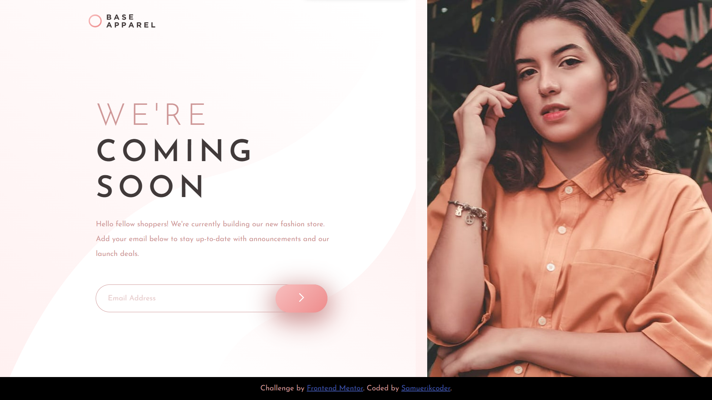

# Frontend Mentor - Base Apparel coming soon page solution

This is a solution to the [Base Apparel coming soon page challenge on Frontend Mentor](https://www.frontendmentor.io/challenges/base-apparel-coming-soon-page-5d46b47f8db8a7063f9331a0). Frontend Mentor challenges help you improve your coding skills by building realistic projects. 

## Table of contents

- [Overview](#overview)
  - [The challenge](#the-challenge)
  - [Screenshot](#screenshot)
  - [Links](#links)
- [My process](#my-process)
  - [Built with](#built-with)
  - [What I learned](#what-i-learned)
  - [Continued development](#continued-development)
  - [Useful resources](#useful-resources)
- [Author](#author)

## Overview

### The challenge

Users should be able to:

- View the optimal layout for the site depending on their device's screen size
- See hover states for all interactive elements on the page
- Receive an error message when the `form` is submitted if:
  - The `input` field is empty
  - The email address is not formatted correctly

### Screenshot

### Links

- Solution URL: [click here]()
- Live Site URL: [click here](https://base-apparel-coming-soonsamuerkicoder.netlify.app/)

## My process

### Built with

- Semantic HTML5 markup
- CSS custom properties
- Flexbox
- CSS Grid
- Mobile-first workflow
- Javascript
- DOM
- Javascript Modules
- Factory Functions

### What I learned

Grid System: The code demonstrates the effective use of CSS Grid to create a responsive layout for the card components. The <body> uses display grid to position the <header>, <picture>, <main>, and <footer> on the screen.

Responsiveness: The code demonstrates a responsive design approach using media queries. By defining different styles for different screen sizes, the layout adapts to varying viewport widths.

Javascript Modules: The JS files of this project were divided into modules seeking to follow good practices of clean code through factory functions with cooerent names about their functionality.

E-mail Validation in JS: In this project, regular expressions were used to validate the use of e-mail.

### Useful resources

- [Project Structure](https://youtu.be/B2WL6KkqhLQ) - This helped me with Project planning, flex-box, grid container, responsiveness and css variables. I really liked this pattern and will use it going forward.
- [Box Shadow Generator](https://cssgenerator.org/box-shadow-css-generator.html) - This helped me get a preview of the shadows I would use on the components.
- [Screen Only Clas (.'sr-only')](https://kittygiraudel.com/snippets/sr-only-class/) - I used the css rules indicated in this article to ensure accessibility on the site

## Author

- Frontend Mentor - [@samuerikcoder](https://www.frontendmentor.io/profile/samuerikcoder)